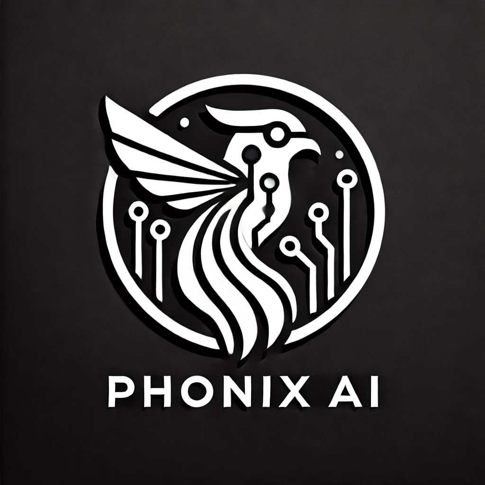

<H1>🛡️🤖 PHONEX AI 🤖⚔️</H1>

🌌 Technologies Utilized

C: Crafting core functionalities to enhance performance in critical components.
Java: Developing robust applications and managing intricate business logic.
Node.js: Streamlining backend processes and ensuring seamless frontend communication.
Shell Script: Automating routine tasks and improving system integration.
Rubyx: Scripting and building supportive tools for optimized workflows.
Lua: Providing lightweight scripting for extensibility and customization.
Go: Designing efficient and scalable services to meet high-demand application needs.
🌟 Programming Languages Used

C
Java
JavaScript (Node.js)
Shell Script
Rubyx
Lua
Go
✨ Project Overview PHONEX AI is an innovative platform developed by HoloFi, focusing on artificial intelligence and decentralized applications (DApps). Utilizing the latest technologies, PHONEX AI aims to deliver secure, efficient, and intelligent solutions for managing digital assets and executing smart contracts. Our mission is to redefine how digital interactions occur, ensuring users benefit from cutting-edge advancements in AI and blockchain technology.

⚙️ Prerequisites

Ensure that you have compilers for C and Java installed on your system.
Install Node.js and npm for managing dependencies and running backend services.
Set up Rubyx and Lua for scripting and automation tasks.
Configure a Shell environment for executing scripts.
Install Go for service development.
Basic understanding of C, Java, Node.js, Shell, Rubyx, Lua, and Go is required.
🚀 Getting Started

Clone the Repository:

sh
Copiar código
git clone https://github.com/nscinc/phonex-ai.git
Install Dependencies:

sh
Copiar código
cd phonex-ai
npm install
Configure the PHONEX AI Network:

Ensure your PHONEX AI client is running and synchronized.
Set environment variables in the .env file with details for your HoloFi network.
Deploy Smart Contracts:

Compile and deploy the necessary smart contracts on the HoloFi network.
Update contract addresses in configuration files (e.g., config.js) after deployment.
Build the Node.js Frontend:

sh
Copiar código
npm run build
Launch the DApp:

sh
Copiar código
npm start
Interact with the PHONEX AI DApp:

Use the provided REST API endpoints to manage digital assets and execute transactions.
Digital assets can be represented as customizable tokens on the HoloFi network.
🌌 Global Integration PHONEX AI is engineered to deliver advanced capabilities that emphasize security, transparency, and computational efficiency in DApps. Our platform is designed to be accessible and usable worldwide.

⚛️ Innovative Approaches and Intelligent Asset Development This platform adopts cutting-edge methodologies to create intelligent digital assets and incorporate quantum computing, expanding the potential for decentralized applications and digital asset management.

🔧 Configuration Updates

Environment Configuration: Update your .env file with recent environment variables relevant to quantum integration and PHONEX AI functionalities.
New Dependencies: New support for quantum integration libraries has been added, alongside updates to existing frameworks.
📜 License This project is licensed under the Apache-2.0 License. See the LICENSE file for more information.

PHONEX AI stands at the forefront of HoloFi technology, offering a robust platform for AI-driven decentralized applications and digital asset management. With its advanced integrations, including quantum computing and global functionalities, PHONEX AI is set to transform the digital landscape.

**FOUNDER: LUCAS JANAURIO DO NASCIMENTO**

